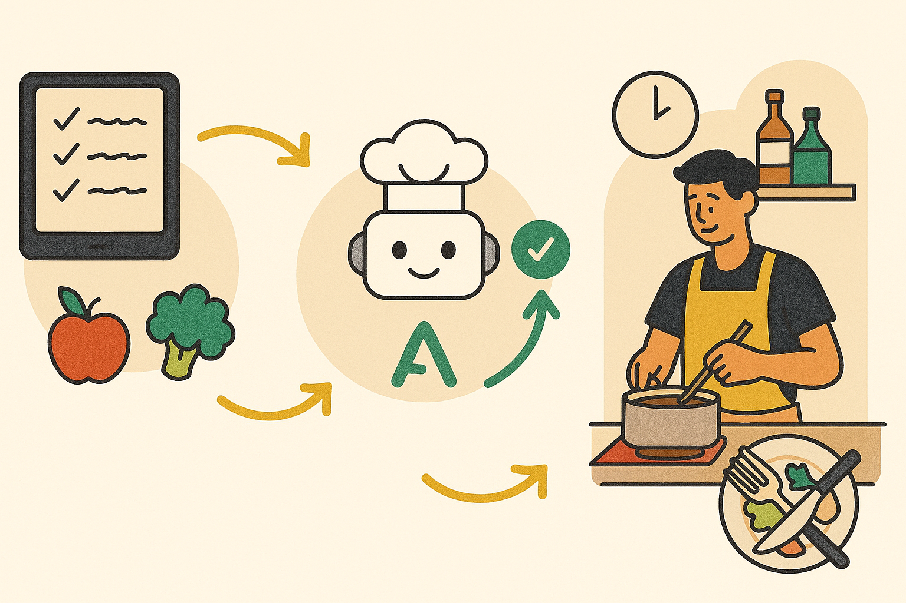
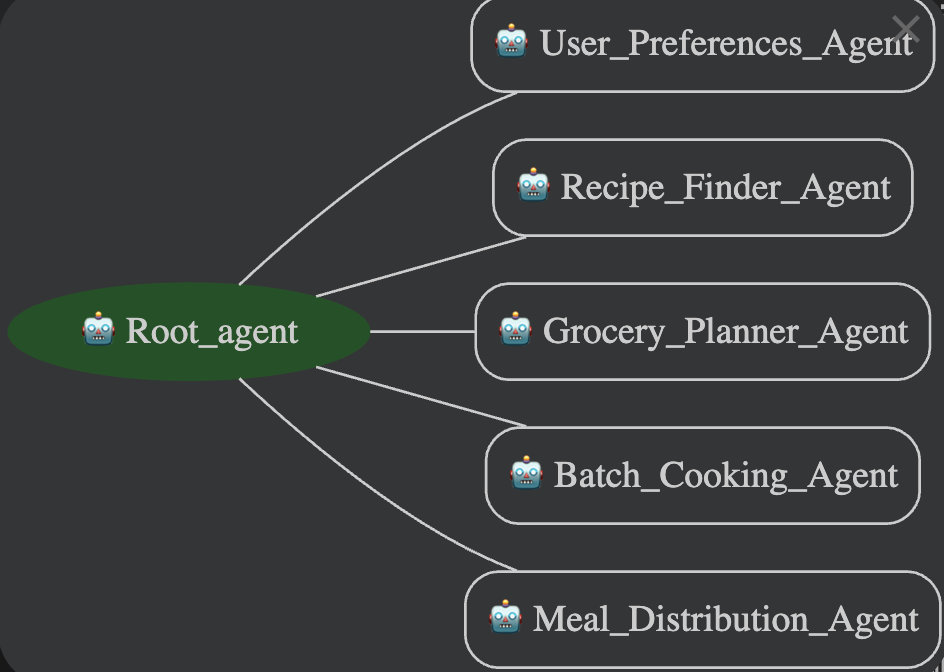

# Personal CookFlow AI Agent

Capstone Project submitted as part of the [5-Day AI Agents Intensive Course with Google (Nov 10 - 14, 2025)](https://www.kaggle.com/competitions/agents-intensive-capstone-project/overview)

🍴 **The Kitchen Chaos**  
Meal planning can feel like juggling knives: grocery lists, nutrition goals, and time constraints often push couples and families toward takeout or skipped meals. CookFlow transforms that stress into simplicity: a one‑day batch‑cooking ritual that clears mental clutter and fills your fridge with ready‑to‑go meals for the week.

[Deployed Agent Link](https://cookflow-ai-agent-service-594161647696.us-central1.run.app)

📹 **See It in Action** 

👩‍🍳 **Enter the Sous‑Chef Agent** 
Static apps give you recipes. Agents adapt to your life. CookFlow acts like a smart sous‑chef: learning your preferences and remembering past meals so you don’t repeat too often. It guides you through prep with just enough structure to keep things flowing, not rigid, but collaborative.

🛠️ **How CookFlow Works** 
CookFlow isn’t just another app — it’s a team of specialized agents working in harmony:
- *Root Agent:* clarifies your goals, asks the right questions, and orchestrates the flow.
- *User Preferences Agent:* remembers your household size, diet, allergies, and pantry staples so every plan fits your life.
- *Recipe Finder Agent:* searches the web for fresh, batch‑friendly recipes that match your constraints.
- *Grocery Planner Agent:* consolidates ingredients into a categorized shopping list, subtracting what you already have.
- *Batch Cooking Agent:* turns recipes into a calm, step‑by‑step cooking ritual with cookware assignments and timing.
- *Meal Distribution Agent:* balances nutrition and variety, mapping dishes into a weekly calendar of lunches and dinners.

**The result:** one seamless flow from intent → discovery → shopping → cooking → distribution. No schema drift, no clutter — just a fridge full of labeled, ready‑to‑go meals.

⏰ **The Weekend Ritual** 
Saturday morning isn’t just for errands anymore — it’s the launchpad for your week. CookFlow turns a few focused hours into a ritual:
- *Plan once, eat all week:* the Root Agent lines up recipes that match your preferences and pantry.
- *Shop smarter:* the Grocery Planner consolidates everything into a clear, categorized list so you breeze through the store.
- *Cook in flow:* the Batch Cooking Agent guides you step‑by‑step, staging tasks so you chop, simmer, and roast without chaos.
- *Portion with ease:* the Meal Distribution Agent maps meals into containers labeled by day and meal, ready to grab and go.

By Sunday evening, your fridge is stocked, your mind is clear, and the week ahead feels lighter. CookFlow makes meal prep less of a chore and more of a ritual — one that saves time, reduces stress, and keeps variety on the table.

🧑‍💻 **Behind the Apron** 
CookFlow isn’t just recipes — it’s infrastructure.
- *Built in Python:* modular agent architecture, clean JSON contracts, and extensible workflows make it easy to adapt.
- *Deployed on GCP Cloud Run:* serverless scaling ensures agents spin up only when needed, keeping costs lean and performance sharp.
- *Orchestrated agents:* Root, Preferences, Finder, Planner, Batch Cooking, and Distribution all run as independent services, coordinated seamlessly.
- *Shared session context:* every agent reads from the same source of truth, so preferences, pantry, and provenance stay consistent end‑to‑end.

**The result:** a resilient, cloud‑native sous‑chef that grows with your household, balancing technical rigor with everyday usability.

📊 **Testing the Sous‑Chef** 
No agent is complete without tasting its own recipes. To evaluate CookFlow, I reached out to people in my network for hands‑on testing.
[Download Analyzed Conversations](./cookflow_agent/src/CookFlow_Agent_Conversations.docx)

- *Limitations:* With a small, familiar sample group, results are preliminary and may skew positive.  

- *Survey responses:* 4 participants shared structured feedback on usability, clarity, and recipe relevance.  
&nbsp; - Ease of use: Most testers found the chat interface intuitive, with average ratings of 4.25/5.  
&nbsp; - Mealplan success: In the majority of conversations, the agent produced complete weekly mealplans; a smaller subset stalled or returned partial outputs.  
&nbsp; - Stress reduction: Only 2 of the respondents reported some reduction in meal‑planning stress.  
&nbsp; - Strengths: Clear grocery lists with quantities, organized workflows, and cultural recipe variety were praised.  
&nbsp; - Limitations: Slow response times, occasional errors retrieving recipes, limited memory of servings, and mobile usability issues.  
&nbsp; - Overall satisfaction: Survey participants rated their experience neutral (3.75/5), with one of them highlighting critical gaps.  
&nbsp; - Users appreciated the intuitive prompts and smooth orchestration across agents, though they noted opportunities for broader recipe variety and more nuanced pantry handling.    

- *Conversations analyzed:* 15 real interactions with the agent revealed how well it adapted to preferences and guided cooking flow.  
&nbsp; - Mealplan success: In ~9 of 15 conversations, the agent produced complete weekly mealplans; ~6 stalled or returned partial outputs.  
&nbsp; - Common issues: slow response, missing recipes for specific cuisines, memory gaps, mobile formatting.  
&nbsp; - Strengths: clear grocery lists, structured cooking flow, stress reduction, cultural variety.    

- *Pressure testing*  
&nbsp; - The agent handled conversations in Spanish, though inconsistently, as multilingual support was not explicitly designed.  
&nbsp; - One user attempted to access environment variables; the agent correctly safeguarded data, demonstrating resilience against unsafe inputs.    

**Next steps:** Expand testing to a larger, more diverse audience to validate adaptability and uncover edge cases.

🌱 **What’s Next on the Menu** 
- Pantry scanning via barcode or photo
- Seasonal produce suggestions and local deal matching
- Voice-first cooking guidance
- Health app integrations for personalized nutrition
- A social layer for sharing batch-cook wins and recipes

