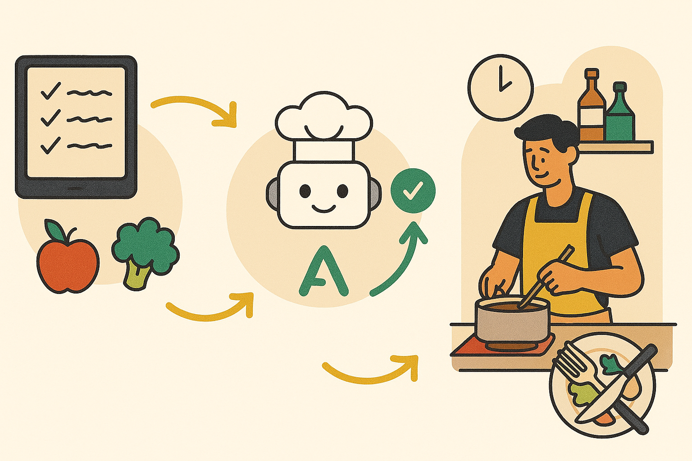

# CookFlow — AI Meal Planning Agent


CookFlow is a multi-agent meal planning assistant for busy families. It handles recipes, grocery lists, and cooking schedules.

Live: [personal-cookflow-ai-agent-594161647696.us-central1.run.app/](https://personal-cookflow-ai-agent-594161647696.us-central1.run.app/)
Portfolio: [slopezza.com/portfolio_CookFlow_Agent](https://www.slopezza.com/portfolio_CookFlow_Agent)

---

## About This Project

CookFlow has been built across two phases, each with a different scope and learning objective.

**V1** was a 5-day sprint during [Google's AI Agents Intensive Course](https://www.kaggle.com/learn-guide/5-day-agents) (November 2025) — a rapid prototype to explore multi-agent coordination with Google ADK and Gemini.

**V2** is a 7-week rebuild during the [LLM Agents Bootcamp](https://ai.science/products-services/llm-agents-bootcamp) by Aggregate Intellect (January–March 2026) — a production-quality iteration driven by real user research, a formal evaluation framework, and deployment to real users.

---

## Version 1 — 5-Day Prototype (November 2025)

> Branch: [`CookFlow_v1.0`](https://github.com/smlopezza/Personal_CookFlow_AI_Agent/tree/CookFlow_v1.0)

Built in 5 days as a capstone for Google's intensive AI Agents course. The goal was to go from zero to a working multi-agent system fast.

### Architecture

Six specialized agents orchestrated by a root coordinator:

| Agent | Role |
|---|---|
| Root Agent | Clarifies goals, collects preferences, orchestrates flow |
| User Preferences Agent | Stores household size, allergens, pantry |
| Recipe Finder Agent | Searches the web for batch-friendly recipes |
| Grocery Planner Agent | Consolidates ingredients into a categorized shopping list |
| Batch Cooking Agent | Generates step-by-step cooking schedules with parallelization |
| Meal Distribution Agent | Maps meals into a weekly calendar with reheating instructions |

**Stack:** Python · Google ADK · Gemini 2.0 Flash · GCP Cloud Run · ADK default chat UI

### Testing Results

- ~15 real conversations with friends and colleagues
- Overall satisfaction: 3.75/5
- ~60% end-to-end completion rate
- Key failures: recipe retrieval on zero constraints, mobile UI unusable, API quota exhaustion on free tier

### What V1 Taught

The 6-agent pipeline was architecturally clean but expensive — each user message triggered 30–50+ Gemini API calls across agent handoffs. The Recipe Finder was the single point of failure: it could not discover recipes from natural language without specific names. And the ADK default UI was not usable on mobile, which is where most users were.

These findings directly drove the V2 redesign.

---

## Version 2 — Production Rebuild (January–March 2026)

Built during the 7-week [LLM Agents Bootcamp](https://ai.science/products-services/llm-agents-bootcamp) by Aggregate Intellect, a program focused on taking agentic AI systems from prototype to production. V2 addressed every critical failure from V1 through a structured engineering process: user research → architecture redesign → iterative prompt engineering → LLM-as-Judge evaluation → observability → real user deployment.

### What Changed

| Dimension | V1 | V2 |
|---|---|---|
| Architecture | 6 agents | 3 agents + tools |
| UI | ADK default chat | Custom FastAPI web app, mobile-first |
| Recipe retrieval | Google Search only | Google Search + curated fallback DB |
| User memory | In-memory only | Firestore with explicit consent flow |
| Evaluation | Manual spot-check | LLM-as-Judge across 11 test cases × 2 paths |
| Observability | None | Cloud Trace + Cloud Logging + Cloud Monitoring |
| Cooking modes | Batch only | Daily / few times a week / batch |
| API tier | Free (20 req/day) | Paid (no quota risk) |
| Mobile support | Broken | Responsive, tested |

---

### Architecture (V2)

Reduced from 6 agents to 3 by consolidating responsibilities and replacing agent-to-agent handoffs with tool calls on the root agent. Each Gemini API call now does more work.

```
Root Agent
├── recipe_finder        (sub-agent)  — Google Search + URL safety net
├── meal_prep_planner    (sub-agent)  — grocery list + cooking schedule + meal plan
├── process_recipes      (tool)       — allergen filter + time extraction
├── recipe_db_fallback   (tool)       — curated recipe DB when search returns empty
├── build_grocery_list   (tool)       — consolidate + scale ingredients
├── load_user_profile    (tool)       — Firestore read
├── save_user_profile    (tool)       — Firestore write (consent-gated)
└── delete_user_profile  (tool)       — Firestore delete (right to erasure)
```

**Stack:** Python · Google ADK v1.4.1 · Gemini 2.5 Flash · FastAPI · GCP Cloud Run · Firestore · Cloud Trace · Cloud Logging · Cloud Monitoring · OpenTelemetry

### Two Operating Modes

**Mode A — Ingredient-first:** User lists what they have. Agent returns 3 recipe options buildable from those ingredients, then a grocery list for only the missing items and step-by-step cooking instructions.

**Mode B — Weekly plan:** Agent plans a full week. Recipe count and cooking schedule adapt to how the user cooks:

| Cooking frequency | Recipes | Schedule type |
|---|---|---|
| Daily | 5 (one per night, ≤45 min each) | Per-night guide — cook fresh each evening |
| Few times a week | 4 | Two cooking sessions, split across the week |
| Batch (once a week) | 4 | Single parallelized session |

Grocery list is always weekly regardless of cooking frequency.

### Key Engineering Decisions

**URL safety net:** The Recipe Finder agent harvests verified URLs from Google Search grounding metadata before the model responds. Any URL in the model's output that was not in the verified set is automatically nulled out — preventing hallucinated recipe links from reaching the user.

**Recipe DB fallback:** A curated database of 50+ proven recipes is queried when Google Search returns empty results. The agent never returns "no results" — it always offers alternatives.

**Consent-gated persistence:** User profiles (household size, allergens, cuisine preferences, cooking frequency) are saved to Firestore only after explicit opt-in. Users can delete their data at any time by asking the agent.

**Structured prompt contracts:** Agent-to-agent context is passed as validated JSON with explicit field contracts, reducing hallucination at handoff boundaries.

---

### Evaluation Framework

V2 was evaluated using an **LLM-as-Judge** approach: a separate Gemini instance scores each agent response across three dimensions without human bias.

**Test suite:** 11 test cases × 2 interaction paths (form submission and chat) = 22 evaluated runs

**Scoring dimensions (1–5 each):**

| Dimension | What it measures |
|---|---|
| Result Presence | Did the agent return the expected number of recipes? |
| Constraint Compliance | Were allergens, time limits, and dietary restrictions respected? |
| URL Integrity | Do the source links point to real, accessible recipes? |


---

### Observability

GCP-native monitoring stack:

- **Cloud Trace** — OpenTelemetry spans per agent call with attributes for recipe count, time overage flags, and allergen context
- **Cloud Logging** — Structured JSON logs per agent event with recipe names, constraint payloads, and error codes
- **Cloud Monitoring** — Custom metrics dashboards tracking recipe count distribution, schedule completeness, and agent latency
- **Alerting** — Policies for recipe count anomalies and recipes missing from the cooking schedule

---

### User Research

V2 improvements were grounded in structured user research:

- 12 user interviews (30 min each)
- Key pain points identified: slow response times, recipe retrieval failures, mobile inaccessibility, over-clarification before acting
- Tested with 5 real household users post-deployment: diverse cooking frequencies (daily, weekly batch, weekends), one safety-critical celiac constraint

---

## Running Locally

```bash
git clone https://github.com/smlopezza/Personal_CookFlow_AI_Agent.git
cd Personal_CookFlow_AI_Agent

pip install -r cookflow_agent/requirements.txt

# Set environment variables
cp .env.example .env
# Add: GOOGLE_API_KEY, GOOGLE_CLOUD_PROJECT, ROOT_AGENT_MODEL, RECIPE_FINDER_MODEL, MEAL_PREP_PLANNER_MODEL

# Authenticate with GCP for Firestore access
gcloud auth application-default login

# Start the FastAPI server from the repo root
uvicorn api.main:app --reload
```

Open `http://localhost:8000` in your browser.

**Requirements:**
- GCP project with Firestore enabled (Native mode)
- Gemini API key — paid tier recommended (free tier exhausts at ~3 conversation turns in the multi-agent pipeline)

---

## Tech Stack Summary

| Layer | Technology |
|---|---|
| Agent framework | Google ADK (Agents Development Kit) v1.4.1 |
| LLM | Gemini 2.5 Flash |
| Web framework | FastAPI |
| Persistent storage | GCP Firestore |
| Deployment | GCP Cloud Run (serverless, auto-scaling) |
| Observability | OpenTelemetry · Cloud Trace · Cloud Logging · Cloud Monitoring |
| Evaluation | LLM-as-Judge (Gemini) · custom test runner |
| Language | Python 3.11 |

---

## About the Author

Sandra Lopez — Senior Data Scientist at Scotiabank, PhD Chemical Engineering (Western University). Working at the intersection of production ML systems and agentic AI.

[LinkedIn](https://www.linkedin.com/in/slopezza/) · [Portfolio](https://www.slopezza.com)
